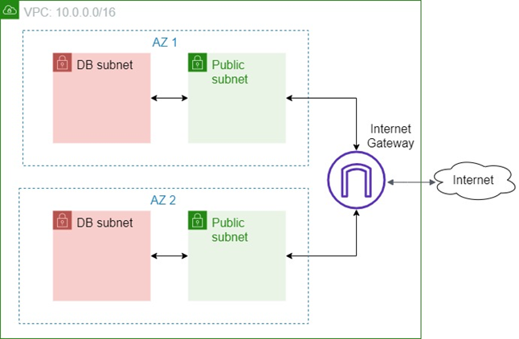

## What to do

1.	Create one or more Cloud Formation templates (YAML or JSON based) which would set up a VPC similar to module 5, but simplified: 

Here:
- the private subnets and the bastion are not required anymore
- the public subnets should not use elastic IPs
- use just ordinary public IPs for accessing EC2 instances in the public subnets
- ensure that the security groups used by the EC2 instances from the public subnets allow HTTP access only from your IP address

2.	Optionally, use the Cloud Formation nesting feature to minimize the amount of template configuration duplication.
3.	Create a Cloud Formation template which creates one EC2 instance based on the AMI from module 4 in one of the custom VPC public subnets.
4.	Optionally, make the template parameterized so that it’s possible to specify the desired subnet during stack creation.
5.	Manually or using a Cloud Formation template, create one EC2 instance in one of the DB subnets and one EC2 instance in one of the public subnets.
6.	Ensure that:
   * the public EC2 instance is accessible from outside VPC and has access to the Internet/DB subnet instance
   * the DB EC2 instance is not accessible from outside VPC and has not access to the Internet

**Optional Task is not mandatory for completion this module but highly recommended, if you don’t have a time to complete it - just skip it*

## What should I remember?
> - Once you create AWS Account -> Setup Multi-factor Authentication
> - Do NOT share your account
> - Do NOT commit your account Credentials into the Git
> - Terminate/Remove all created resources/services once you finish Module
> - Please Do not forget to delete NAT Gateway if you used it.
> - Do NOT keep instance running if you don’t use it
> - Carefully keep track of billing and working instances so you don't exceed limits 
