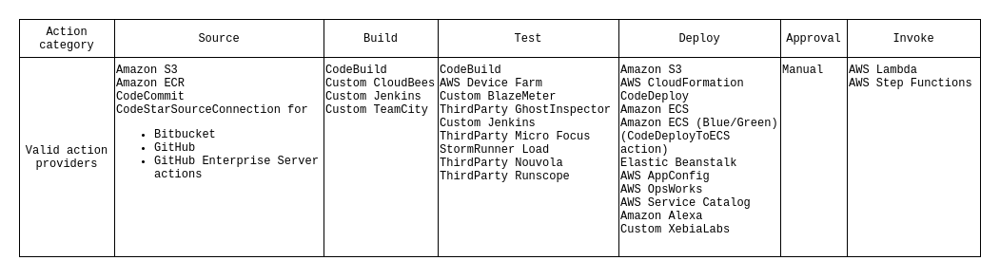

# CI/CD with AWS

## Self-check:

### 1. How to set up different deployment strategies (blue-green, canary) via the AWS CodeDeploy?

 - `Blue-Green Deployments`:

    - In a blue-green deployment, the version of the application currently running in production (the "blue" environment) is replaced with a new version (the "green" environment). `During the deployment, both versions are running, with traffic gradually shifted from the blue to the green environment`. Once the deployment is `verified to be successful`, all traffic is directed to the green environment, and the blue environment can be decommissioned.

    - `Blue-green` setup deployment with `AWS CodeDeploy`:

        - `Create an AWS CodeDeploy application and deployment group`. In the deployment group settings, set the Deployment type to Blue/Green.

        - `Under the Deployment settings`, you can choose whether to use `Amazon EC2` instances or `AWS Lambda functions` for your deployment.

        - `In the Environment configuration` section, specify the instances or functions that will serve as your replacement (green) environment.

        - `For Load balancer`, you can optionally add a load balancer to shift production traffic from your original (blue) environment to the replacement (green) environment.

        - `After you've configured your deployment group,` you can create a new deployment and choose your newly created deployment group. The blue-green deployment process will start when you create a deployment.

 - `Canary Deployments`:

    - A canary deployment `involves deploying the new version of an application to a small subset` of instances before rolling it out to the rest. This allows you to test the new version in a production-like environment with real traffic and mitigate potential risks.

    - `Canary deployments` setup for `AWS Lambda functions` using `AWS CodeDeploy`, follow these steps:

        - `In AWS CodeDeploy`, create a new application and deployment group, and choose Lambda as the Compute platform.

        - For `Deployment type`, choose Canary.

        - Set the `Deployment settings` to one of the predefined canary options, such as 10% of traffic for 10 minutes, or customize your own.

        - For the` environment configuration`, select the `Lambda function to deploy`.

        - After you've set up your `deployment group`, create a new deployment and select your deployment group. The `canary deployment process will begin when you create the deployment`.

 - `Note` that `AWS CodeDeploy` manages the process of gradually shifting customer traffic to the new version of the application - you `don't need to manually control this process`.

 - `Note` that for `canary deployments`, you need to `create a new version of your Lambda function for each new deployment`, as the traffic is routed between different versions of the function.

### 2. What is application, revision, deployment, deployment configuration, and deployment group in terms of AWS CodeDeploy?

 - `Components of the deployment process`:

    - `Application`: `is name that uniquely identifies the application you want to deploy`. CodeDeploy uses this name, which functions as a container, to ensure the correct combination of revision, deployment configuration, and deployment group are referenced during a deployment.

    - `Revision`: `is a version of your application`. A revision in AWS CodeDeploy is a version of deployable content, such as source code, web and configuration files, executables, packages, scripts, etc. It is typically stored in either Amazon S3 buckets or GitHub repositories. Each time you update your application's content, you create a new revision.

    - `Deployment`: A deployment in AWS CodeDeploy is the process and the components used when updating a Lambda function or an EC2/On-premises compute platform.

    - `Deployment Configuration`: `is set of deployment rules` and deployment success and failure conditions used by CodeDeploy during a deployment.

    - `Deployment Group`: `is a set of individual instances`. A deployment group contains individually tagged instances, Amazon EC2 instances in Amazon EC2 Auto Scaling groups, or both.

### 3. What is stage, action and transition in CodePipeline?

 [CodePipeline User Guide](https://docs.aws.amazon.com/codepipeline/latest/userguide/welcome.html) 

- `Stage`: A stage in AWS CodePipeline is a phase of the pipeline process, which contains one or more actions that are executed as part of the stage. For example, a pipeline can have a stage for building the application, another stage for testing it, and another stage for deploying it. Each stage in a pipeline depends on the successful completion of the previous stage.

- `Action`: An action in AWS CodePipeline represents a task performed on an artifact (code or similar). An action occurs within a stage. Examples of actions include building code in the source stage, deploying to a test environment in the deploy stage, or running a set of tests in the test stage.

- `Transition`: A transition in AWS CodePipeline refers to the progression from one stage to the next in a pipeline. Transitions can be enabled or disabled, which allows you to control the flow of artifacts from one stage to the next. For example, if you want to manually approve a deployment, you can disable the transition from the testing stage to the deployment stage, and then enable it once you're ready to proceed.

- In `summary`, a pipeline is composed of multiple stages. `Each stage can have one or more actions`, and the transition from one stage to the next is controlled by enabling or disabling transitions.

### 4. What is pricing for the AWS CodeCommit/AWS CodeDeploy/AWS CodePipeline services?

- [AWS CodeDeploy Pricing Calculator](https://calculator.aws/#/addService/CodeDeploy)

- [AWS CodePipeline Pricing Calculator](https://calculator.aws/#/createCalculator/CodePipeline)

- [AWS Free Tier](https://aws.amazon.com/free)

### 5. What is CI?

- `Continuous integration` is a DevOps software development practice where developers regularly merge their code changes into a central repository, after which automated builds and tests are run. `Continuous integration` most often refers to `the build or integration stage of the software release process` and entails both an automation component (e.g. a CI or build service) and a cultural component (e.g. learning to integrate frequently).

### 6. What is CD (delivery)?

- `Continuous delivery` is a software development practice where code changes are automatically prepared for a release to production.​

### 7. What is CD (deployment)?

- The difference between `continuous delivery` and `continuous deployment` is the presence of a **`manual approval`** to update to production. With `continuous deployment`, `a release to production happens automatically without explicit approval`. 

### 8. What CodePipeline best practices do you know?

 - `Best practices` when working with `AWS CodePipeline`:

    - `Use Parallel Execution and Manual Approvals`: If you have tasks that can be run simultaneously, configure them to run in parallel to save time. For stages that require critical assessment or human intervention, such as deployments to production, consider using manual approval actions.

    - `Monitor Your Pipelines`: Use AWS CloudWatch to monitor your pipelines. Set up alerts to be notified of pipeline failures. CodePipeline also integrates with AWS CloudTrail to log API calls for security analysis and auditing.

    - `Use CodePipeline with Other AWS Services`: CodePipeline integrates well with other AWS services. Use CodeCommit for source control, CodeBuild for building and testing your application, and CodeDeploy for deployment. This allows you to keep your entire CI/CD pipeline within the AWS ecosystem.

    - `Secure Your Pipelines`: Apply the principle of least privilege to your pipeline's IAM roles to minimize security risks. Enable versioning in your S3 buckets to keep track of changes to your application's source code and build artifacts.

    - `Automate Testing`: Incorporate automated testing into your pipeline to catch bugs and issues earlier in the development process.

    - `Use Parameter Store or Secrets Manager`: If your application needs access to sensitive information like database credentials or API keys, don't embed them in your code. Use AWS Systems Manager Parameter Store or AWS Secrets Manager to securely store and manage sensitive information.

    - `Use Infrastructure as Code (IaC)`: Define and manage your AWS resources using IaC tools like AWS CloudFormation or Terraform. This allows you to version control not just your application code but also your infrastructure, leading to more reliable and reproducible deployments.

    - `Design Your Pipeline for Failure`: Assume that any action in your pipeline can fail. Design your pipeline in such a way that it's easy to identify and diagnose failures when they occur.

    - `Keep Your Pipelines Fast`: Optimize your pipeline to provide quick feedback. Long-running pipelines can slow down the development process. Break down large pipelines into smaller, more manageable ones if necessary.

    - `Artifact Management`: Avoid having large artifacts in your pipeline as it can slow down the process. Clean up your old artifacts regularly to save on storage costs.

### 9. How easy is it to migrate from more traditional services like GitHub/GitLab onto CodeCommit?

- `Steps to perform a migration`:

    - `Create a CodeCommit Repository`: First, you'll need to create a new repository in AWS CodeCommit.

    - `Clone the Existing Repository`: Next, clone the existing repository from GitHub or GitLab onto your local machine using Git.

    - `Push to CodeCommit`: After cloning the repository, you can then change the remote repository URL to your newly created CodeCommit repository and push the code.

### 10. How would you compare CodeCommit to Git?

- `CodeCommit` is a secure, highly scalable, managed source control service that hosts private Git repositories.​ It provides:
    - Integration with other AWS services​
    - Pull requests and approval templates​
    - Access control​

### 11. What are the key elements of an app spec in CodeDeploy?

`CodeDeploy` is a deployment service that automates application deployments to Amazon EC2 instances, on-premises instances, serverless Lambda functions, or Amazon ECS services. You can deploy:​
- `Code​`
- `Serverless AWS Lambda functions​`
- `Web and configuration files​`
- `Executables​`
- `Packages​`
- `Scripts​`
- `Multimedia files`

### 12. What are the key elements of a build spec in CodeBuild?

`CodeBuild` is a fully managed build service in the cloud. ​It's features include:

- `Fully managed` – CodeBuild eliminates the need to set up, patch, update, and manage your own build servers.​

- `On demand` – CodeBuild scales on demand to meet your build needs. You pay only for the number of build minutes you consume.​

- `Out of the box` – CodeBuild provides preconfigured build environments for the most popular programming languages. All you need to do is point to your build script to start your first build.​

### 13. What AWS services may aid CodeBuild execution?

### 14. What 3rd party tools and other AWS services may participate CodePipeline execution?

- `3rd party tools` and other `AWS services` may `participate CodePipeline execution` -> `SOURCE COLUMN`.

- [CodePipeline actions](https://docs.aws.amazon.com/codepipeline/latest/userguide/integrations-action-type.html) provide a wide variety of AWS and third-party services. The diagram below lists available actions by type:

