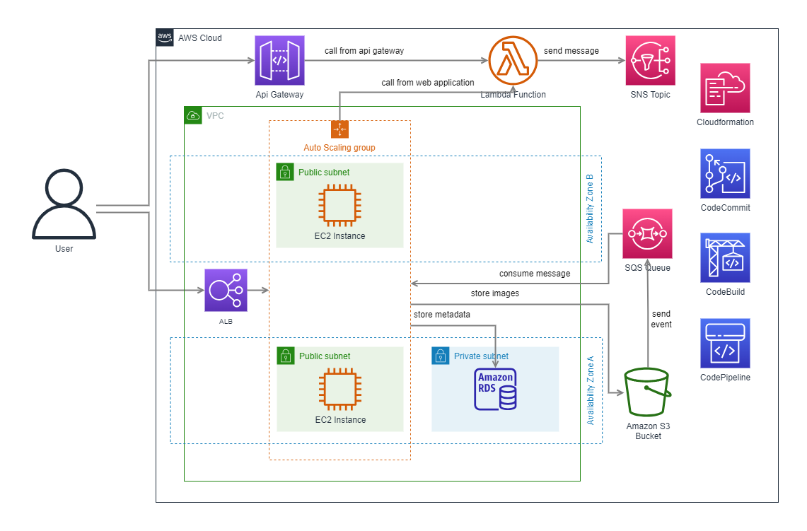

## What to do

### Sub-task 1 – create and deploy SAM application

1. Create a SAM application for lambda from the module 9:
   - Create a SAM template for lambda function and store it in the root of your project
   - Specify IAM roles, required for integration with SNS, SQS from previous module. Also,
   specify the role to allow storing logs in CloudWatch
   - Following this [tutorial](https://docs.aws.amazon.com/serverless-application-model/latest/developerguide/automating-updates-to-serverless-apps.html), define any *DeploymentPreferenceType* you wish
   - *Optionally*: specify in the template additional Lambda functions for testing the SAM
   deployment
2. Delete the Lambda function AWS resource from module 9
3. Following this [tutorial](https://docs.aws.amazon.com/serverless-application-model/latest/developerguide/serverless-sam-cli-install.html), install SAM CLI on your local machine
4. Using the terminal on your local machine, execute **sam package** CLI command with appropriate
   flags to store the packaged lambda to S3. Under the packaged lambda is considered some
   executable artifact(for example jar file for Java)
5. Using **sam deploy** CLI command and generated output template file from the previous step,
   deploy the lambda function with appropriate resources
6. In AWS console, open Lambda service and find in **Functions** section your deployed lambda
   function. Also, in **Applications** tab, find your deployed SAM application and review all created
   resources
7. Upload a new image to the image S3 bucket, trigger the recently deployed Lambda (manually or
   by schedule), and ensure an email notification which mentions the image is sent

### Sub-task 2 – build CI/CD pipeline

1. Create a CodeCommit repository and port your project from EPAM GitLab into it.
2. Following [this tutorial](https://docs.aws.amazon.com/codebuild/latest/userguide/getting-started-cli-create-build-spec.html) create a CodeBuild spec, which would:
   - provide instructions for testing the code (optionally)
   - build the executable artifact(for example jar file for Java)
   - package the code for the Lambda function using **sam package** CLI command from the
   previous sub-task.
   - specify the generated output template file as build artifact in the artifacts section for
   further using it for deploy
   - **Important**: don’t use **same deploy** cli command. Lambda will be deployed through
   CodeDeploy service.
3. Create a CodeBuild project using AWS console:
   - choose created in the previous step AWS CodeCommit repository (with already stored
   CodeBuild spec there) as the source provider
   - configure environment for building the artifact
   - specify S3 bucket for storing the build artifact
   - Manually start the build. Verify that output template file, generated by sam package
   command, was stored in S3. In the CodeUri section of this file, you could find the link to the
   packaged Lambda code, stored in S3
4. Create a CodePipeline project and configure:
   - **Source Stage** - **Code Commit** - automatically runs after commit into your repo from
   subtask1 and pulls all your sources
   - **Build Stage** - **Code Build** - uses your source code and runs SAM package to upload lambda
   source/package to S3 and generates CloudFormation **output template**. You could reuse
   already create build project from the previous step
   - **Deploy Stage** - **Cloud Formation** as action provider - uses **output template** from second
   step to deploy lambda
5. Delete Lambda function resources created in previous sub-task
6. Make some changes to the Lambda function code and ensure the CodePipeline builds and deploys
   it.
7. Repeat the step 7 from the sub-task 1.