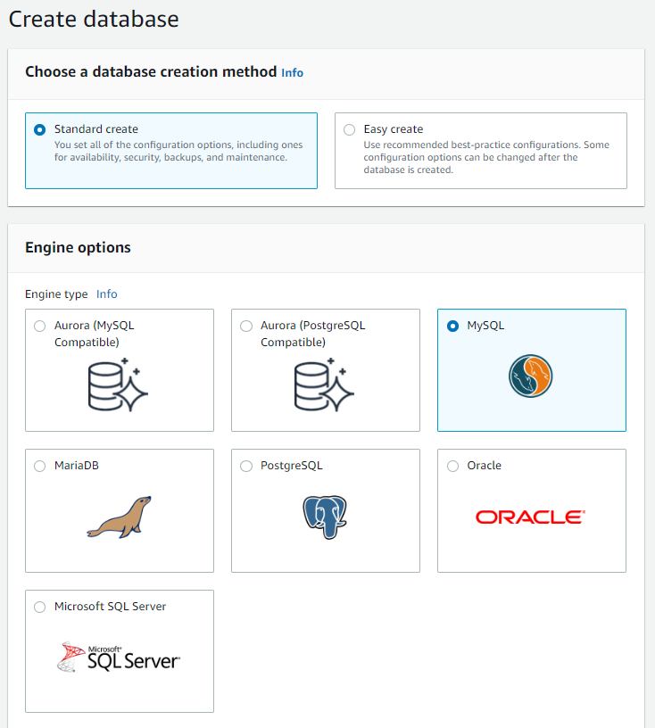
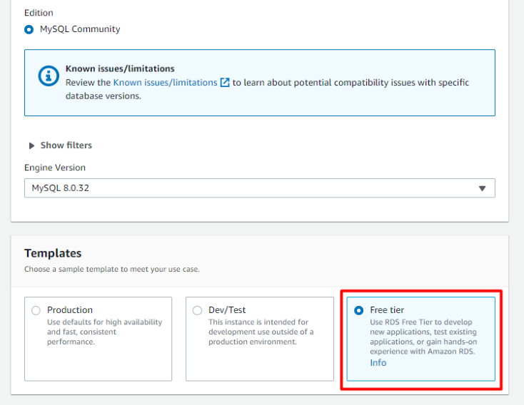
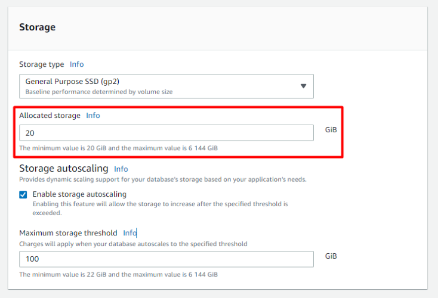

## What to do

### Sub-task 1 - Update web application 
1. Update your web application to include the following functions: 
   - download an image by name
   - show metadata for the existing image by name
   - show metadata for a random image
   - upload an image
   - delete an image by name

**Note.** The image metadata should include: last update date, name, size(in bytes), and file extension.

### Sub-task 2 - Add DB instance to store metadata
1. Create an RDS instance in one of the DB subnets (Private Subnets) of your VPC. Choose creation method and engine type. 

**WARNING: Select a free-tier template.**

2. Be careful during configuring storage for your RDS instance. Choose min allocated storage value to save money.

3. After uploading some images, make some SQL queries to the RDS instance bypassing the web application – for example, from the EC2 instances over SSH.
4. The overall infrastructure should look like this:
5. Ensure the following non-functional criteria are met: 
    - the EC2 instance should use IAM roles to access RDS/S3 
    - the EC2 instance should claim the role using the [AWS credentials provider chain](https://docs.aws.amazon.com/sdk-for-java/v1/developer-guide/credentials.html#credentials-default)
6. Optional: use AWS Identity and Access Management (IAM) database authentication to connect your application to the DB instance. 
    - AWS Documentation with examples can be found here - [Connecting to your DB instance using IAM authentication](https://docs.aws.amazon.com/AmazonRDS/latest/UserGuide/UsingWithRDS.IAMDBAuth.Connecting.html)
    - AWS RDS + Spring Boot example - [RDS IAM Authentication with Spring Boot](https://ordina-jworks.github.io/cloud/2022/06/13/aws-rds-iam-authentication-spring-boot.html)

 
* *Optional Task is not mandatory for completion this module but highly recommended, if you don’t have a time to complete it - just skip it*
