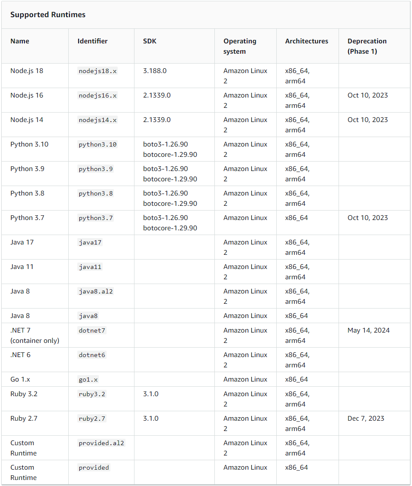
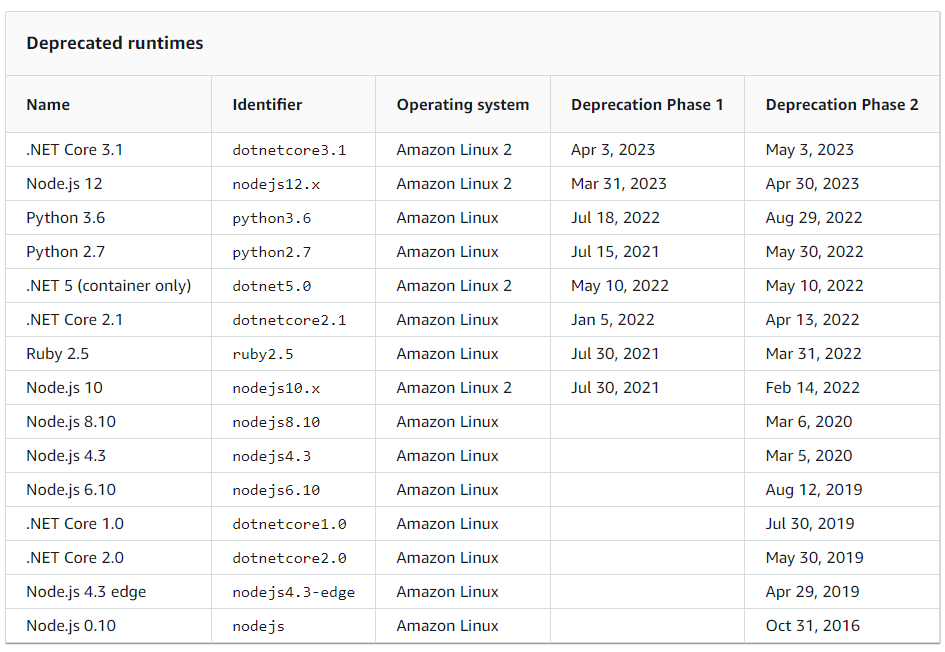
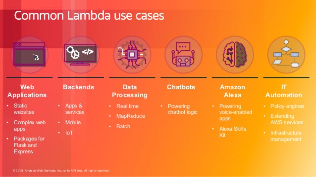

# AWS Serverless

## Self-check

### 1. What is the biggest benefit of AWS Lambda?

- `AWS Lambda` is a serverless compute service that lets you run your code without provisioning or managing servers. It has several benefits, but the most significant one is likely its ability to significantly reduce operational overhead and complexity.

    - `Key benefits of AWS Lambda`:
        - `No Server Management`: Lambda automatically runs your code without requiring you to provision or manage servers. You can just write the code and upload it to Lambda.

        - `Continuous Scaling`: Lambda automatically scales your applications in response to incoming request traffic. You don't need to worry about capacity planning or managing scaling operations.

        - `Subsecond Metering`: With AWS Lambda, you are charged for every 100ms your code executes and the number of times your code is triggered. This fine-grained billing offers potential cost savings compared to EC2 instances, which are billed by the hour.

        - `Event-driven Execution`: Lambda functions are designed to be triggered by events, such as changes to data in an Amazon S3 bucket or updates to a DynamoDB table. This makes it a powerful tool for building responsive, event-driven systems.

        - `Integrated Security Model`: With AWS Lambda, you can set up your code to automatically trigger from other AWS services or call it directly from any web or mobile app. AWS Lambda integrates with AWS Identity and Access Management (IAM) providing you control over who can invoke your Lambda functions.

        - `Built-in Fault Tolerance`: AWS Lambda has built-in fault tolerance. Lambda maintains compute capacity across multiple Availability Zones in each region to help protect your code against individual machine or data center facility failures.

        - `Rapid Development and Deployment`: With Lambda, you can focus on your code and business logic, rather than spending time on infrastructure setup, maintenance, and scaling. This can lead to more rapid development and deployment cycles.

### 2. What ways of triggering a Lambda do you know?

 - `AWS Lambda can be triggered` in several ways, including but not limited to:

    - `Event Source Triggers`: AWS services can invoke your Lambda function when certain events occur. For example, changes to data in an Amazon S3 bucket or a DynamoDB table can trigger a Lambda function.

    - `HTTP Triggers via API Gateway`: You can create a RESTful API with Amazon API Gateway and invoke your Lambda function via HTTP endpoints.

    - `Scheduled Events (Cron) with CloudWatch`: You can set up AWS Lambda to execute your code at regular intervals with scheduled events. This is similar to running cron jobs.

    - `AWS SDKs`: AWS provides SDKs for a variety of languages (like JavaScript, Python, .NET, Java, Go) which can be used to call a Lambda function directly from your application code.

    - `Step Functions`: AWS Step Functions can be used to create serverless workflows that chain together Lambda functions and other AWS services to create complex processing jobs.

    - `SNS and SQS`: Both Simple Notification Service (SNS) and Simple Queue Service (SQS) can trigger Lambda functions. You can have a Lambda function subscribe to SNS topics or poll SQS queues.

    - `AWS CloudFormation`: AWS CloudFormation can invoke a Lambda function as part of the stack creation process. This can be useful for custom setup logic that isn't supported directly by CloudFormation's resource types.

    - `AWS IoT`: AWS IoT can trigger a Lambda function when it receives a message from a connected device.

    - `AWS Cognito`: AWS Cognito can trigger a Lambda function during various user pool operations like user sign-up, confirmation, and sign-in with a pre or post invocation Lambda trigger.

    - `AWS Kinesis and DynamoDB Streams`: Both Kinesis Data Streams and DynamoDB Streams can trigger a Lambda function to process data in near real-time.

    - `Alexa Skills Kit`: Alexa Skills Kit can invoke a Lambda function to fulfill a voice command from an Alexa device.

    - `AWS CloudTrail`: CloudTrail can trigger a Lambda function when it detects specific API activity and log events.

    - `AWS CodeCommit`: CodeCommit can invoke a Lambda function in response to code commits.

### 3. What is the contract of Lambda function?

 - `The contract of an AWS Lambda function` pertains to the agreed `structure and behavior of the function`, which `includes the input event format`, `the output format`, and the `error handling behavior`.

    - `Input Event Format`: AWS Lambda functions are event-driven. They are designed to process an event input and generate a response. The format of this input event is often determined by the event source. For example, if the Lambda function is triggered by an S3 event (like the creation of a new object), the input will contain details about the S3 bucket and the object. Similarly, for an API Gateway event, the input will contain details about the HTTP request.

    - `Output Format`: The output of a Lambda function is consumed by the invoker or the service that triggered the function. For synchronous invocations (like API Gateway), the output (including HTTP status code, headers, and body) is sent back to the invoker as a response. For asynchronous invocations, the output is discarded unless the function is configured to send the result to a destination.

    - `Error Handling`: If a Lambda function encounters an error, it should throw an exception or return a rejection in the case of Node.js. AWS Lambda treats any non-zero exit status from the Lambda function runtime as an invocation error. For asynchronous invocations, AWS Lambda will automatically retry the invocation twice, with delays between retries. For stream-based event sources (like DynamoDB streams and Kinesis Data Streams), AWS Lambda will block the event source until the Lambda function successfully processes the records or the data expires.

    - `Environment`: The contract also covers the environment in which the function runs, including the AWS SDK version, the language runtime version, the allocated memory, the execution time limit, the IAM role, environment variables, etc.

    - `Permissions`: The Lambda function operates under an IAM role which grants it permissions to access AWS services and resources. This IAM role forms part of the contract, as it determines what actions the function can and cannot do.

    - `Concurrency`: The contract includes the expected concurrency model. AWS Lambda can run the function concurrently in response to multiple triggers, and you can optionally configure the function to limit its maximum concurrency.

### 4. What is Lambda pricing?

 - `AWS Lambda pricing is based on two components`:

    - `The number of requests`: You are charged based on the number of requests for your functions. This includes tests through the AWS Management Console. AWS provides 1 million requests free each month.

    - `The duration`: The time it takes your code to execute, rounded up to the nearest 100ms. The price depends on the amount of memory you allocate to your function.

### 5. Which code libraries/frameworks are reasonable to use in Lambda? 

- `AWS Lambda` currently `supports` several programming languages, including:

    - `.NET`
    - `Go`
    - `Java`
    - `Node.js`
    - `Python`
    - `Ruby`
    - `PowerShell`

### 6. How Lambda instances are reused? How to prepare the Lambda code for that? 

- To improve performance, `AWS Lambda` may choose to `retain` an instance of your function and `reuse` it to serve a subsequent request, rather than `launching a new copy of the function with each request`. This is referred to as a `"warm start"`.

- `Preparing` your Lambda code to take advantage of instance reuse:

    - `Initialization Code`: Any code that is outside the handler function (the function that AWS Lambda calls when your function is invoked) is run only once, when the function instance is created. This is a good place to put initialization code that you want to run only once, such as database connections, HTTP clients, and other resources that you plan to reuse.

    - `Global Variables`: Because the function instance may be reused across multiple invocations, you can use global variables to persist data across invocations. However, you should be careful with this, as there is no guarantee of how long a function instance will be reused, and different function instances do not share state. You should not put any sensitive information or request-specific information in global variables.

    - `Cleanup`: If your function opens resources (like database connections), you should design your function to cleanly close those resources when they are no longer needed. If your function execution is prematurely terminated, AWS Lambda will attempt to reuse the existing execution context for subsequent invocations.

    - `Cold Start and Warm Start`: A cold start occurs when you execute an inactive function for the first time. It includes initialization time and code execution time. A warm start occurs when you call a recently-run function and AWS reuses the previous execution context. You can optimize for warm starts by minimizing the amount of work done in the initialization code, and by regularly invoking your function to keep it warm.

### 7. What programming languages does Lambda support? 

- `Supported runtimes`:

- `Deprecated runtimes`:

### 8. What is the difference between synchronous and asynchronous Lambda invocations? 

- `Main difference`:
    - `Synchronous invocation`: When a Lambda function is invoked synchronously, the calling service `sends a request to Lambda and waits for a response`. The `calling service is blocked until the Lambda function` finishes executing and returns a response. Any `errors` that the Lambda function throws are `passed back to the calling service`. HTTP APIs, REST APIs, and the AWS SDKs typically use synchronous invocation.

    - `Asynchronous invocation`: When a Lambda function is invoked asynchronously, the calling service `sends a request to Lambda and immediately receives a response indicating that Lambda has accepted the request`. The `actual execution` of the Lambda function happens in the `background`. The `calling service is not blocked` and does not wait for the function execution to complete. If the function returns an error, Lambda handles the error, but the `error is not passed back to the calling service`. Services like S3, SNS, and CloudWatch Events typically use asynchronous invocation.

### 9. What is Lambda concurrency? 

- `Main types of concurrency` in `AWS Lambda`:

    - `Provisioned Concurrency`: This is the number of function instances that are initialized and ready to respond immediately to your function invocations. By configuring provisioned concurrency, you can ensure that your function can scale without fluctuations in latency. You can configure provisioned concurrency to prepare and reserve a specific number of execution environments so that they are always ready to respond to your function's invocations. This helps to keep the function's latency consistently low and is particularly useful for latency-sensitive applications.

    - `On-Demand Concurrency`: This is the number of function instances that are serving requests at a given time. When a Lambda function is invoked, AWS Lambda launches an instance of the function to process the event. When the function code finishes running, it can handle another request. If the function is invoked again while a request is still being processed, another instance is allocated, increasing the function's concurrency.

- `There are also concurrency limits` in `AWS Lambda`:

    - `Reserved Concurrency`: This is the number of concurrent executions that are reserved for a specific function. When you set a reserved concurrency limit for a function, no other function can use this concurrency. The total available concurrency for all other functions in the account is the total account concurrency limit minus the total reserved concurrency for all functions.

    - `Unreserved Concurrency`: This is the remaining concurrency available within your account, after accounting for all the reserved concurrency for all functions. Unreserved concurrency is shared among all functions that don't have a specified reserved concurrency.    

### 10. What kinds of Lambda concurrency allocations are there? 

 - `Concurrency allocations in AWS Lambda`:

    - `Provisioned Concurrency`: Provisioned concurrency keeps functions initialized and hyper-ready to respond in double-digit milliseconds. This allows you to serve high volumes of requests with consistent start-up times. When you configure provisioned concurrency for your function, AWS Lambda initializes the requested number of execution environments so that they are prepared to respond to your function's invocations. It's a good choice for applications with very spiky traffic patterns and for applications that cannot tolerate any cold start latencies.

    - `On-Demand Concurrency`: AWS Lambda manages all the operational aspects of scaling, patching, and administration of the compute layer. It launches as many copies of the function as needed to scale to the rate of incoming events. After a Lambda function is executed, AWS Lambda maintains the function execution context for some time in anticipation of another function invocation. This is a great choice for unpredictable workloads, as AWS handles scaling automatically.

- `AWS Lambda` also `supports Reserved Concurrency`. When you configure reserved concurrency for a function, AWS reserves a portion of your account level concurrency limit for that function. Other functions have access to the remaining unreserved concurrency. Reserving concurrency for a function ensures that it can always reach a certain level of concurrency and prevents it from using more than a certain level of concurrency.

### 11. What AWS resources can Lambda access? How?

- `Use cases`:

- You can use AWS Lambda to extend other AWS services with custom logic, or create your own back-end services that operate at AWS scale, performance, and security. AWS Lambda can automatically run code in response to multiple events, such as HTTP requests via Amazon API Gateway, modifications to objects in Amazon S3 buckets, table updates in Amazon DynamoDB, and state transitions in AWS Step Functions.

- After you upload your code to AWS Lambda, you can associate your function with specific AWS resources `(e.g. a particular Amazon S3 bucket, Amazon DynamoDB table, Amazon Kinesis stream, or Amazon SNS notification)`. Then, when the resource changes, Lambda will execute your function and manage the compute resources as needed in order to keep up with incoming requests.

- `How ? `
    - `Access to these resources is controlled by IAM` (Identity and Access Management) roles that you assign to your Lambda function. The IAM role attached to a Lambda function defines what AWS service or resources that function can interact with. This makes it possible to strictly control what a specific Lambda function can and cannot do, enhancing the security of your AWS environment.

### 12. What are the advantages of API Gateway endpoints over traditional web applications?

### 13. What are the typical API Gateway use cases? What is the use case for combining API GW with Lambda?

### 14. What is the use case for combining API GW with Lambda?

### 15. What is API Gateway pricing?

