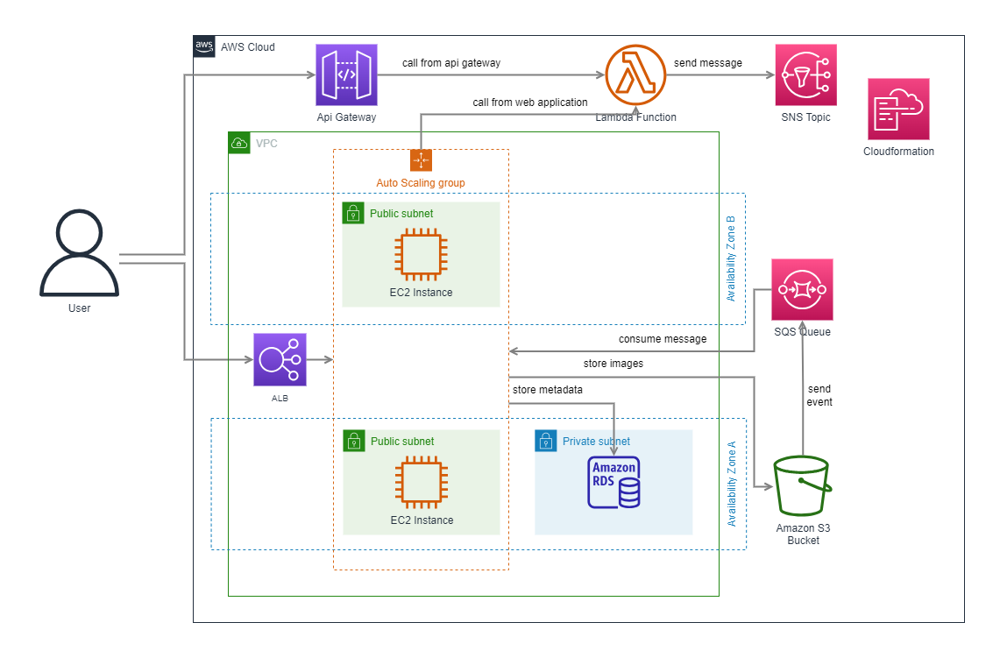

## What to do

### Sub-task 1 – create a Lambda for batching upload notifications

1. Create a Lambda function named _\<ProjectName\>-uploads-batch-notifier_:
   - use any preferred programming language 
   - grant the function the basic Lambda permissions as well as permissions for pulling from the _\<ProjectName\>-uploads-notification-queue_ 
   - configure the Lambda to run the code that you wrote for module 7 for transferring SQS messages to SNS (DO NOT FORGET to remove that code from the web-application to avoid functionality duplication)
   - **important**: make sure your Lambda tries polling N messages for a limited period of time (timeout) of 2-3 seconds and does nothing in case no messages found
2. Publish the _\<ProjectName\>-uploads-batch-notifier_.
3. Make 2 or more image uploads using your web application and trigger your Lambda manually. Ensure you got exactly one email with all the publications you’ve just made.

### Sub-task 2 – add Lambda triggers

1. Create an API Gateway endpoint which would allow access only from your IP address and simply trigger the _\<ProjectName\>-uploads-batch-notifier_ Lambda. 
2. Create an endpoint in your web application which would do the same – simply trigger the _\<ProjectName\>-uploads-batch-notifier_ Lambda. 
3. Follow [this tutorial](https://docs.aws.amazon.com/AmazonCloudWatch/latest/events/RunLambdaSchedule.html) to make your Lambda run periodically (let’s say, every 5 minutes). 
4. Make your Lambda logs scheduled/API Gateway/web application calls in such a way that it’s possible to distinguish them in the CloudWatch logs. **Hint** – the tutorial from step 3 makes the Lambda receive messages which have a _detail-type_ field, so it’s possible to fill that field differently for the calls made from the web application and API Gateway endpoint. 
5. Make sure you can see all 3 (scheduled/API Gateway/web application) kinds of Lambda calls in the CloudWatch logs. 
6. Create a separate Lambda function which simply takes in an S3 object creation event and logs the S3 object name. Configure your S3 image bucket to send object creation events to that Lambda.
   - Tip: Since the Lambda handler code is extremely simple, you may code it directly in the AWS Console using any of the available scripting language options.
7. Upload an image to your S3 bucket and ensure you can see the Lambda reacts to this in CloudWatch logs.