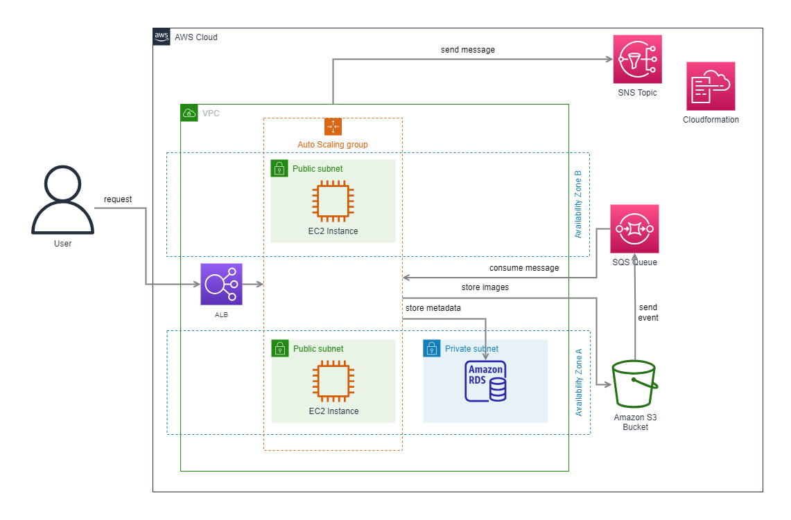
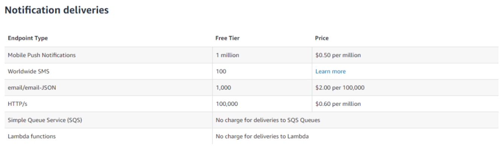

## What to do

### Task – Implement a subscription feature in your web application

1. Create a standard SQS queue named <ProjectName>-uploads-notification-queue.
2. Create an SNS topic named <ProjectName>-uploads-notification-topic.
3. Add two new endpoints in your web-applications :
   - subscribe an email for notifications
   - unsubscribe an email from notifications
4. After a user visits the subscription endpoint, the specified email should receive a confirmation message.
5. Whenever a user visits the unsubscription endpoint, AWS should stop sending the email notifications.
6. Whenever an image is uploaded using your web application, a message describing that event should be published to the SQS queue.
7. Update your web-application to run a scheduled background process which extracts the SQS messages in batch and sends them to the SNS topic.
8. The SNS notifications should be in plain text which includes:
   - an explanation that an image has been uploaded
   - the image metadata (size, name, extension)
   - a link to the web application endpoint for downloading the image
   Optional: add an additional attribute to the message your app will send to the SNS topic (such as an image extension) and configure the filtering policy for subscriptions to accept messages with a specific attribute value (such as .png).
9. It’s unlikely that you’ll hit SNS free tier limits, but keep them in mind:

10. Think what are the other ways of receiving SNS notifications for the image uploads (not necessarily in a human-readable form).