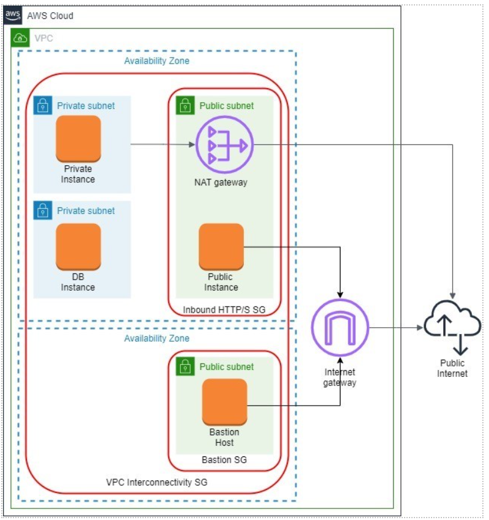

## What’s given
Your AWS account

## What to do
Create a VPC which fulfills the following architecture (AWS diagram notation):

1. The VPC should have a name following this convention _\<ProjectName\>-Network_ and a CIDR block of _10.0.0.0/16_.
2. Create an internet gateway named _\<ProjectName\>-IGW_ and attach it to the VPC.
3. Create two public subnets in the VPC:
   - _\<ProjectName\>-PublicSubnet-A_ in the first AZ with a CIDR block of _10.0.11.0/24_.
   - _\<ProjectName\>-PublicSubnet-B_ in the second AZ with a CIDR block of _10.0.21.0/24_.
   - Make them public and choose _Auto-Assign Public IP_.
   - Create a new route table named _\<ProjectName\>-PublicRouteTable_. Add a _10.0.0.0/16_ – _Local_ route and a route to the _\<ProjectName\> IGW_ to it.
   - Associate the subnets with the new route table.
4. Create private subnet in the VPC:
   - _\<ProjectName\>-PrivateSubnet-A_ in the first AZ with a CIDR block of _10.0.12.0/24_. 
   - Create new route table named _\<ProjectName\>-PrivateRouteTable-A_. Add a _10.0.0.0/16_ – _Local_ route to it. 
   - Associate private subnet with the new route table.
5. Create DB subnet in the VPC:
   - _\<ProjectName\>-DbSubnet-A_ in the first AZ with a CIDR block of _10.0.13.0/24_. 
   - Create a new route table named _\<ProjectName\>-DbRouteTable_. Add a _10.0.0.0/16_ – _Local_ route to it. 
   - Associate DB subnet with the new route table.
6. Create NAT gateway for the private subnet in public subnet:
   - _\<ProjectName\>-NatGateway-A_ with an elastic IP for the subnet _\<ProjectName\>-PrivateSubnet-A_. 
   - Add the gateway _A_ to the route table _\<ProjectName\>-PrivateRouteTable-A_.
   
   **NOTE: Be aware about costs for NAT ~ 1$ per day. Remove if not using right now.**

7. Create a bastion host in the public subnet in the second AZ.
8. Create EC2 instance in the public subnet in the first AZ. Install the application developed in module 3 on the public instance.
9. Create one EC2 instance in the private subnet and one EC2 instance in the DB subnet. The instances do not have to have any special contents.
10. Create security groups:
    - To allow inbound SSH traffic only from your IP address. Apply security group to the bastion host. 
    - To allow inbound HTTP/S traffic from anywhere. Apply security group to the public instance. 
    - To allow all inbound traffic from other instances associated with this security group. The security group should specify itself as a source security group in its inbound rules. Apply security group to all the instances.
11. Ensure:
    - the application on the public instance is available from anywhere 
    - the private and DB instances are available from the bastion ONLY when you’re connected to it over SSH (use the _ping_ command or also _ssh_ them)
    - the bastion host and public instance have access to the Internet (_ping_ Google, for example)
    - the private instance has access to the Internet (_ping_ Google, for example)
    - the private and public instances have access to the DB instance (_ping_ again)
    - the DB instance have no Internet access